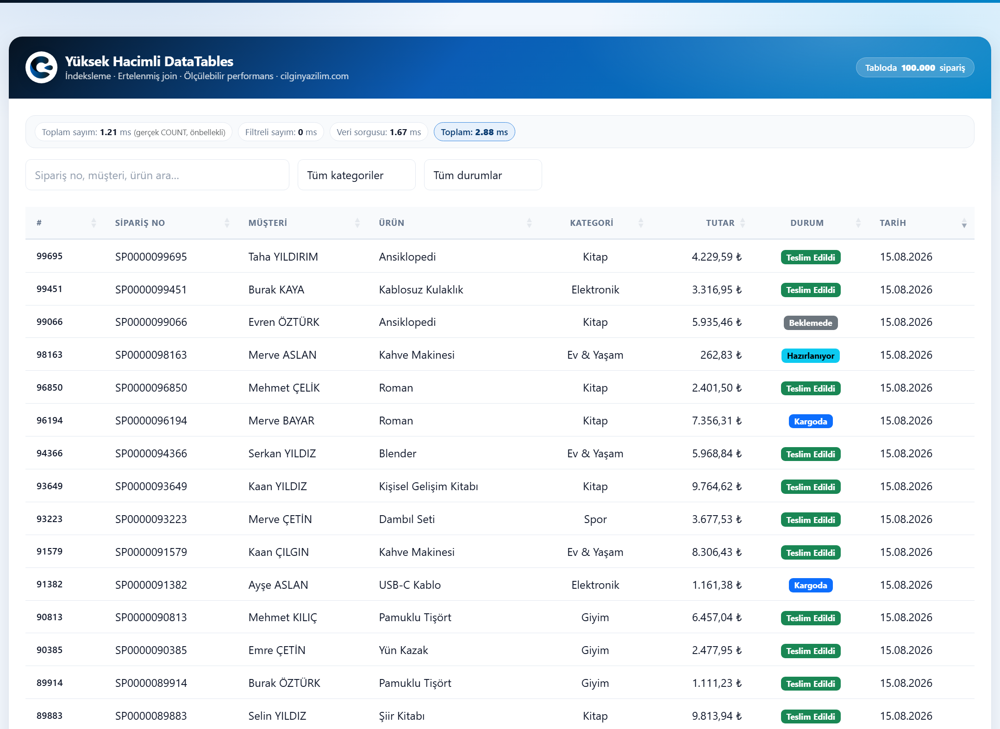

<div align="center">


# High-Volume DataTables Performance

Server-side DataTables over a **100,000-row** table.
Indexing · Deferred join · Cached exact counts · **Measurable** performance

[cilginyazilim.com](https://cilginyazilim.com) · MIT License · 🇹🇷 [Türkçe](README.md)

</div>

---

<div align="center">

</div>

That single frame sums up the whole repository: the table holds **100,000 orders** and the page rendered in **2.88 ms** — the "100,000" in the badge isn't an `information_schema` estimate either, it's the **real** `COUNT(*)` that actually drives pagination (see [Decision 1](#decision-1--estimated-count-or-cached-exact-count)).

This repo is both a working example and a performance log: **every number here was measured**, none estimated.

---

## Table of contents

- [Why server-side processing is mandatory](#why-server-side-processing-is-mandatory)
- [Measured performance table](#measured-performance-table)
- [Decision 1 — Estimated count, or cached exact count?](#decision-1--estimated-count-or-cached-exact-count)
- [Decision 2 — Why `LIKE '%...%'` can't use an index, and what we did](#decision-2--why-like-cant-use-an-index-and-what-we-did)
- [Decision 3 — The cost of deep pagination](#decision-3--the-cost-of-deep-pagination)
- [Index decisions](#index-decisions)
- [Sort stability — a subtle but expensive trap](#sort-stability--a-subtle-but-expensive-trap)
- [Security layers](#security-layers)
- [API contract](#api-contract)
- [HTTP status codes](#http-status-codes)
- [Database schema](#database-schema)
- [File structure](#file-structure)
- [Installation](#installation)
- [Customization](#customization)
- [Example use cases](#example-use-cases)

---

## Why server-side processing is mandatory

Using DataTables in "client-side" mode means **shipping every row to the browser**. We measured what that means for 100,000 rows:

| | Send the whole table (client-side) | Send one page (server-side) |
|---|---|---|
| JSON size | **18.11 MB** | **4.8 KB** |
| gzipped | 2.06 MB | ~1.5 KB |
| Fetch from database | 514 ms | 1.2 ms |
| JSON encoding in PHP | 167 ms | ~0 ms |
| PHP peak memory | **122 MB** | < 1 MB |

**3,860× less data.** And this table only measures the server side; after downloading those 18 MB the browser still has to build 100,000 `<tr>` nodes — more than enough to crash a mobile tab.

With server-side processing the browser receives **only the 25 rows it displays**; filtering, sorting and pagination happen in the database, over indexes. This repository is about doing that database-side work **correctly**.

---

## Measured performance table

100,000 rows, MySQL 8 / InnoDB, XAMPP, PHP 8.2. Each value is the **median** of 5 runs, server-side time (`timings.total_ms`).

| Scenario | Before | After (cold) | After (warm) | Gain |
|---|---|---|---|---|
| Unfiltered first page | 55.75 ms | 56.98 ms | **2.14 ms** | 26× |
| Sort: Product | 251.32 ms | 58.77 ms | **2.08 ms** | 121× |
| Sort: Date | 53.46 ms | 62.27 ms | **1.99 ms** | 27× |
| Search: `Zeynep` (full scan) | 349.64 ms | 239.58 ms | **4.96 ms** | 70× |
| Search: `SP0000050000` (exact) | 424.55 ms | 52.65 ms | **2.11 ms** | **201×** |
| Filter: `status` | 53.50 ms | 113.99 ms | **2.55 ms** | 21× |
| Filter: `category` | 79.23 ms | 76.45 ms | **3.75 ms** | 21× |
| Deep page (OFFSET 99,000) | 240.25 ms | 111.21 ms | **61.99 ms** | 3.9× |

**What do "cold" and "warm" mean?** Cold = the count cache is empty and `COUNT(*)` actually runs. Warm = the count comes from cache (0.12 ms). In real usage the first request is cold and **every subsequent paging/sorting request is warm** — the "warm" column is what a user clicking a column header actually experiences. We publish both, because showing only the warm numbers would hide the cache's cost.

Deep pagination curve (warm):

| OFFSET | 0 | 1,000 | 25,000 | 50,000 | 99,000 |
|---|---|---|---|---|---|
| Time | 2.02 ms | 2.77 ms | 19.29 ms | 40.45 ms | 65.22 ms |

---

## Decision 1 — Estimated count, or cached exact count?

### The bug we found

This repo used to read the total row count as an **estimate** from `information_schema.TABLES.TABLE_ROWS`. The code's own comment claimed:

> "But it is never used for PAGINATION LOGIC (how many pages are there?) — that always relies on recordsFiltered, i.e. a REAL COUNT(*) result."

**That claim was false.** When no filter was applied the code did `$recordsFiltered = $recordsTotal`, so the estimate drove pagination directly. `recordsFiltered` is precisely the field DataTables uses to answer **"how many pages are there?"**. Measured:

```
Real COUNT(*)                          : 100,000
recordsFiltered in response (estimate) :  99,316
Last id on the last reachable page     :  99,325
Real MAX(id)                           : 100,000
→ 675 rows were completely UNREACHABLE.
```

Worse, this happened on the **default, unfiltered view** — the first screen everyone sees. Applying any filter triggered a real `COUNT(*)` and the problem disappeared; exactly the most-used screen was broken.

### Why "just run ANALYZE TABLE" is wrong

We tried it. After `ANALYZE TABLE orders` the estimate dropped to **99,579** — the gap *grew* from 310 to **421**. The estimate comes from InnoDB's random index-page sampling; "fresher" does not mean "more accurate". Within a single working session we watched the estimate wander **99,690 → 99,579 → 99,316** on an unchanged table, purely because `ALTER TABLE` and `ANALYZE TABLE` recomputed statistics.

### The decision we made

**The number that drives pagination is always a real `COUNT(*)`; a file cache absorbs its cost.** The `information_schema` estimate is no longer read anywhere in the app.

An intermediate version kept the estimate instead of deleting it — displayed in the UI **next to** the real number, on the reasoning that "seeing both numbers side by side is instructive." That's an honest part of the process worth recording here too: from the moment the badge existed, the estimate was **constant** (it doesn't change on an unchanged table), so re-reading it on every request bought nothing — we were just paying the `information_schema` query's own cost (~0.8 ms) over and over. The badge was removed from the UI and the query went with it; the measurements in this section remain as a **permanent warning**, because "why `information_schema` can't be trusted" is worth having written down somewhere so the same mistake isn't repeated.

### The cache's trade-off (we're not hiding it)

`SELECT COUNT(*) FROM orders` takes **47 ms**. In InnoDB `COUNT(*)` is not read from a ready counter (it was in MyISAM); the whole smallest secondary index gets scanned. Adding 47 ms to every request would turn our 2 ms page back into a 49 ms one. Reading the file cache costs **0.12 ms** — 390× cheaper.

**But isn't a cache "possibly wrong" too — how is it different from an estimate?**

| | `information_schema` estimate | Cached `COUNT(*)` |
|---|---|---|
| How wrong? | **Unknowable** (0.3%–50%) | At most TTL **stale** |
| Known direction? | No, drifts both ways | Yes, only lags behind |
| Self-correcting? | **No** | Yes, exact once TTL expires |
| Does `ANALYZE TABLE` fix it? | **No** (measured; it got worse) | Irrelevant |
| Can it be made exact after a write? | No | **Yes** (`count_cache_forget()`) |

The difference is fundamental: an estimate is a **permanent error of unknown direction**; a cache is a **bounded delay that closes by itself**. Since this project is read-only the table never changes between requests, so the cached number is always correct. In a write-heavy system, lower `COUNT_CACHE_TTL` or call `count_cache_forget()` after `INSERT`/`DELETE` — `seed.php` does exactly that.

**Filtered counts are cached too.** Paging through 40 pages of a search result used to pay another 175 ms `COUNT(*)` on every page — recomputing the same number 40 times.

---

## Decision 2 — Why `LIKE '%...%'` can't use an index, and what we did

### Why it can't

B-tree indexes are sorted **left to right**, like a dictionary. Finding words that **start with** something is easy; finding words that **contain** something requires reading the dictionary cover to cover. MySQL is in the same position:

```sql
WHERE customer_name LIKE 'Zeynep%'   -- ✅ index RANGE — 6.15 ms
WHERE customer_name LIKE '%Zeynep%'  -- ❌ full scan (ALL) — 77.79 ms
```

### The bug we found

The old code wrapped three columns in `%...%` **no matter what** was typed. The most galling consequence:

```
LIKE '%SP0000050000%'          → 415.53 ms   type=ALL,   key=NULL, rows=99,316
order_number = 'SP0000050000'  →   0.49 ms   type=const, key=uniq_orders_number, rows=1
```

**848× difference.** The `uniq_orders_number` unique index was already there — the code simply never used it, because it wrapped an exactly-matching order number in `%...%` as well.

### The decision: route by the shape of the input

`classify_search()` recognises three paths:

| Input | Path | SQL | Time |
|---|---|---|---|
| `SP0000050000` (SP + 10 digits) | **exact** | `order_number = ?` | **2.11 ms** |
| `SP000005` (SP + 1–9 digits) | **prefix** | `order_number LIKE 'SP000005%'` | **3.65 ms** |
| `Zeynep`, `ÇILGIN`, `Kablosuz` | **scan** | `LIKE '%...%'` over 3 columns | 4.96 ms warm / 239 ms cold |

The chosen path is **printed on screen** ("Search path: full scan (LIKE %…%)"). The cost is not hidden.

### Why we didn't speed up general search — FULLTEXT was tried and REJECTED

A `FULLTEXT(customer_name, product)` index was actually created and measured. Reasons for rejection, from **our own measurements**:

**1. It cannot match mid-word.** FULLTEXT indexes words as tokens; there is no equivalent of `%eyne%`:

```
LIKE '%eyne%'                 → 5,003 rows   (middle of "Zeynep")
MATCH ... AGAINST ('eyne*')   →     0 rows
```

When a user types "ÇILGIN" they are searching for a **surname** — at the end of the customer name. A fast search that returns the wrong result is **worse** than a slow one.

**2. It turned out slower, contrary to expectation.** After `idx_orders_date` was added the optimizer's options changed: for a frequently-matching search it can follow the sort index and **stop early** once it has 25 rows.

```
Search 'Zeynep' — data query:
  LIKE '%Zeynep%'  :  3.09 ms
  FULLTEXT MATCH   : 25.36 ms
```

**3. It doesn't cover order numbers**, minimum token length is 3 (`innodb_ft_min_token_size`), and a sixth index carries a write cost.

**Honest limitation:** the `scan` path still performs a full table scan and takes ~240 ms cold. We did not **solve** this, we tamed it: fast paths drain the most common searches, the count is cached (paging within the same search costs 5 ms), and this path carries a **separate, tighter** rate limit. If you genuinely need "contains" search well beyond 100,000 rows, the right tool is a search engine such as Elasticsearch/Meilisearch — not MySQL.

---

## Decision 3 — The cost of deep pagination

`LIMIT 25 OFFSET 99000` tells MySQL: *"produce 99,025 rows, then THROW AWAY the first 99,000."* The **full row data** of the discarded rows is read too — 8 columns, all wasted.

### The decision: deferred join (late row lookup)

First select **only the ids**, from the covering `(order_date, id)` index — that subquery **never touches the table** (`Using index`). Then fetch the full rows for the surviving 25 ids via the primary key (25× `type=eq_ref`):

```sql
SELECT o.id, o.order_number, ...
  FROM orders o
  JOIN (SELECT id FROM orders
         ORDER BY order_date DESC, id DESC
         LIMIT 25 OFFSET 99000) k ON k.id = o.id
 ORDER BY o.order_date DESC, o.id DESC
```

| OFFSET | Plain `OFFSET` | Deferred join | Gain |
|---|---|---|---|
| 0 | 0.65 ms | 0.93 ms | *(0.3 ms slower)* |
| 1,000 | 66.39 ms | **1.36 ms** | 49× |
| 25,000 | 136.07 ms | **15.99 ms** | 8.5× |
| 50,000 | 165.21 ms | **30.71 ms** | 5.4× |
| 99,000 | 252.98 ms | **61.26 ms** | 4.1× |

We publish the **0.3 ms regression** on the first page too — the join has its own cost and there are no rows to discard on page one. Everywhere past row 25 it wins.

### Why not keyset (seek) pagination?

Keyset pagination (`WHERE order_date < ? LIMIT 25`) eliminates `OFFSET` entirely and runs in **constant time on every page**. It is the technically superior solution and would turn 61 ms into 0.6 ms.

We did not adopt it because **the DataTables UI gives users page numbers**: you can jump to "page 2,847". With keyset pagination the starting key of page 2,847 is **unknown** — you can only reach it by walking through the preceding 2,846 pages. Keyset is right for "next/previous" buttons and infinite scroll; it is **incompatible with a page-number UI**.

This is a deliberate trade-off: if you can give up page numbers, switch to keyset.

---

## Index decisions

**Every index has a price.** We measured it: with all secondary indexes present, a 20,000-row bulk `INSERT` takes **2,262 ms**; with `idx_orders_amount` and `idx_orders_customer` dropped, **1,267 ms**. Nearly double the write cost. The table carries **11.5 MB of data** against **33.2 MB of indexes**.

To justify that price we must show what each index buys on reads. In DataTables every column header is clickable; **an unindexed sortable column means a 100,000-row filesort on every click.**

| Column | Index | Time |
|---|---|---|
| `id` | `PRIMARY` | 0.56 ms |
| `order_number` | `uniq_orders_number` | 0.63 ms |
| `customer_name` | `idx_orders_customer` | 0.59 ms |
| `category` | `idx_orders_category` | 0.59 ms |
| `amount` | `idx_orders_amount` | 0.54 ms |
| `status` | `idx_orders_status_date` | 0.64 ms |
| `order_date` | **MISSING** → added `idx_orders_date` | 53.32 ms → **0.61 ms** |
| `product` | **MISSING** → added `idx_orders_product` | 253.61 ms → **0.70 ms** |

### `idx_orders_date (order_date, id)` — the most critical finding of this round

The UI's **default sort** is `order_date DESC`. That is the first screen everyone sees. Without this index:

```
ORDER BY order_date DESC LIMIT 25
→ type=ALL, key=NULL, Using filesort, 54.45 ms
```

MySQL read and sorted **all** 100,000 rows to display 25. **Nearly all of the default screen's 55 ms was this.**

**Why didn't `(status, order_date)` cover it?** The *leftmost-prefix rule*: a composite index can only be used via prefixes starting from its left. `(status, order_date)` is sorted by `status` first; `order_date` is sorted **within** each `status` block. Five status values = five separate date-sorted blocks, and merging them is the same work as sorting.

**Why append `id`?** (1) Sort stability (see below). (2) **Covering**: the deferred join's subquery selects only `id`; `(order_date, id)` satisfies it without touching the table at all.

### Measured and deliberately NOT added: `(category, order_date)`

```
with idx_orders_date        : 1.00 ms
with (category, order_date) : 0.72 ms
```

Paying a sixth secondary index's write cost for 0.28 ms is not worth it. **Adding an index is a decision, not a reflex.**

### `ENUM` (status) vs `VARCHAR` (category)

Measured at comparable selectivity — contrary to expectation, the difference is **small**:

| | indexed `COUNT` | index disabled (full scan) |
|---|---|---|
| `status = 'kargoda'` (ENUM, 14,839 rows) | 11.54 ms | 50.54 ms |
| `category = 'Kitap'` (VARCHAR, 19,953 rows) | 16.61 ms | 52.94 ms |

`ENUM`'s real benefit is **not speed** but storage (1 byte in-row) and **data integrity** — an invalid status value is rejected at the database level. Keeping `category` as `VARCHAR` is equally deliberate: categories are **data** the business adds and removes; an `ENUM` requiring `ALTER TABLE` for every new category causes locking in production.

---

## Sort stability — a subtle but expensive trap

For pagination to be **stable**, `ORDER BY` must end in a key that uniquely identifies rows. Otherwise the order of equal-valued rows is not guaranteed, and moving to page 2 may show you a row you already saw on page 1. This is concrete here: **3,645 groups** share the same `(status, order_date)` pair.

Appending `, id` to every sort is **tempting but wrong** — it breaks the index. We fell into this trap in our own fix, measured it, and reverted:

```
ORDER BY status, id              → 64.95 ms   (Using filesort)  ❌
ORDER BY status, order_date, id  →  0.93 ms   (Using index)     ✅

ORDER BY order_number, id        → 127.76 ms  (Using filesort)  ❌
ORDER BY order_number            →   0.84 ms  (Using index)     ✅
```

**Why?** In InnoDB the primary key is already appended to every secondary index; `idx_orders_customer` is really `(customer_name, id)`, so `ORDER BY customer_name, id` is a direct prefix of it. But `idx_orders_status_date` is `(status, order_date, id)` — `ORDER BY status, id` is **not a prefix**, because `order_date` in between is skipped. In the other direction, `order_number` is already `UNIQUE` and therefore uniquely identifying; appending `, id` buys **nothing** while breaking the optimization.

The correct rule: **build the shortest key list needed for stability, following the order of the index that serves that column.** The code does this per column in `sort_keys()`.

---

## Security layers

Even for a showcase app, an insecure example gets **copied**. Everything found and fixed, with its measurement:

### 1. File access (there was no `.htaccess` at all)

| Path | Before | After |
|---|---|---|
| `/system/config.php` | **200** (opened a DB connection on every call) | **403** |
| `/system/function.php` | **200** | **403** |
| `/cy_datatable.sql` | **200** (schema was downloadable) | **403** |
| `/.gitignore` | **200** | **403** |
| `/assets/js/` | **200** (directory listing) | **403** |
| `/README.md` | **200** | **403** |

`system/.htaccess` uses a **whitelist** (`Require all denied` + only `ajax.php` opened). With a blacklist, every file added tomorrow would be **open by default**. In security the **direction of the default** matters more than the rule itself.

Second layer: the `CY_APP` guard inside the files. `.htaccess` is only read by Apache with `AllowOverride` on; on nginx the PHP check is what runs.

### 2. Security headers (all four were missing)

Added `X-Content-Type-Options`, `X-Frame-Options`, `Referrer-Policy`, `Permissions-Policy` and a **CSP**. The CSP contains no `'unsafe-inline'`: the page's single inline `<script>` is signed with a **nonce** that changes on every request.

### 3. Session fixation — it really worked

Tried with a forged id:

```
Cookie: PHPSESSID=cytest26664ffa2245a4e620ee
→ The server ACCEPTED it, issued no new Set-Cookie,
  minted a CSRF token under it, and /system/ajax.php returned HTTP 200.
```

Closed with `session.use_strict_mode=1`. In the same test the server now issues a fresh id and the forged-id request returns **403**.

Cookie flags were missing too (`PHPSESSID=...; path=/`). Now: `HttpOnly; SameSite=Lax`, plus automatic `Secure` under HTTPS.

### 4. CSRF rejection 419 → 403

419 is not an official HTTP status code, and **the Apache in this setup silently converted it to 500** (measured). The body carried the right message while the status code said "server crashed". Replaced with `403`.

### 5. Rate limiting (there was none)

The `list` endpoint requires no authentication but is expensive. Burning server time with unauthenticated requests is a cheap DoS lever.

**The limit was set by measurement.** Driving the real UI in real Chrome and counting XHRs: **11 requests during 9.1 seconds of uninterrupted heavy use** (1 load, 3 paging, 3 sorting, 2 filters, 2 searches). The key detail: those 2 search requests came from **14 keystrokes** — search is debounced by 350 ms. Without debouncing, the same typing would have produced **14 requests and 14 full table scans**.

Extrapolated, that pace is ~72 requests/min — the pace of a script clicking every 400 ms, not a human.

| Bucket | Limit | Verification |
|---|---|---|
| `list` (all requests) | **120 / min** | 72 requests → all 200. 429 on the 121st, with `Retry-After: 58` |
| `search` (full scans only) | **30 / min** | 429 on the 31st scan; **60 exact-match searches → all 200** |

The second, tighter limit applies only to the **expensive** path: indexed order-number searches never hit it.

Rate limiting runs **after** CSRF. If it ran before, an attacker without a token could fill the counter and **lock out legitimate users** — the limit itself would become an attack tool.

### 6. Already solid (verified by regression tests)

- **No SQL injection**: column names come from a whitelist; `order[0][column]=99&dir=DROP` → 200, safe default.
- **No XSS**: `e()` is applied server-side; a customer name containing `<script>` comes back as `&lt;script&gt;`.
- **`length=999999`** → capped at 500 rows. **`start=-5`** → `max(0, ...)`.
- **`seed.php` is unreachable from the web** (`PHP_SAPI !== 'cli'` → 403). It is a destructive script (`TRUNCATE`).

---

## API contract

Single endpoint: `POST system/ajax.php`. Read-only — there is no CRUD.

### Request

In addition to DataTables' standard server-side parameters:

| Field | Type | Description |
|---|---|---|
| `draw` | int | DataTables counter — **race protection**, echoed back verbatim |
| `start` | int | Rows to skip (`max(0, …)`) |
| `length` | int | Page size (capped at **500**) |
| `search[value]` | string | Search text — path chosen by `classify_search()` |
| `order[0][column]` | int | Column index (0–7), resolved via whitelist |
| `order[0][dir]` | string | `asc` \| `desc` (anything else → `desc`) |
| `category_filter` | string | Category name |
| `status_filter` | string | An `ORDER_STATUSES` key |
| `csrf_token` | string | **Required** (or the `X-CSRF-Token` header) |

### Response

```json
{
  "draw": 7,
  "recordsTotal": 100000,
  "recordsFiltered": 100000,
  "data": [[99695, "SP0000099695", "Taha YILDIRIM", "…"]],
  "timings": {
    "count_total_ms": 0.31,
    "count_filtered_ms": 0,
    "data_query_ms": 1.24,
    "total_ms": 1.55
  },
  "meta": {
    "count_cached": true,
    "search_mode": "scan",
    "search_label": "full scan (LIKE %…%)"
  }
}
```

`timings` and `meta` are **not part of the DataTables contract** — they are teaching extras feeding the on-screen badges.

### How is the race condition prevented?

When a user pages quickly, a late response can overwrite a newer one. The protection is **at the protocol level**: the client increments a `draw` counter on every redraw, and DataTables **silently discards** any response whose `draw` is lower than the current counter. Verified in the DataTables 1.13.6 source:

```js
if (+r < t.iDraw) return;
```

The server's only job is to **echo the value back verbatim** — which the code does (measured: `draw=7` → `"draw": 7`, as an integer). We tested concurrent requests using two separate sessions; the protection holds even when responses arrive out of order.

---

## HTTP status codes

| Code | When |
|---|---|
| **200** | Successful listing |
| **403** | Invalid/missing CSRF token, or direct access to `system/` files |
| **405** | Any method other than `POST` |
| **429** | Rate limit exceeded — with a `Retry-After` header and `retry_after` field |
| **500** | Unexpected server/database error |

> **Note:** The Apache in this setup does not recognise **419** and silently converts it to **500** (measured). `403` is the correct code for a CSRF rejection anyway.

---

## Database schema

```sql
CREATE TABLE `orders` (
  `id`             INT UNSIGNED NOT NULL AUTO_INCREMENT,
  `order_number`   CHAR(12)     NOT NULL,   -- 'SP' + 10 digits, fixed length
  `customer_name`  VARCHAR(120) NOT NULL,
  `product`        VARCHAR(150) NOT NULL,
  `category`       VARCHAR(60)  NOT NULL,
  `amount`         DECIMAL(10,2) NOT NULL,  -- the CORRECT type for money (not FLOAT)
  `status`         ENUM('beklemede','hazirlaniyor','kargoda','teslim_edildi','iptal')
                     NOT NULL DEFAULT 'beklemede',
  `order_date`     DATE         NOT NULL,
  `created_at`     TIMESTAMP    NOT NULL DEFAULT CURRENT_TIMESTAMP,

  PRIMARY KEY (`id`),
  UNIQUE KEY `uniq_orders_number`   (`order_number`),
  KEY `idx_orders_date`         (`order_date`, `id`),
  KEY `idx_orders_status_date`  (`status`, `order_date`),
  KEY `idx_orders_category`     (`category`),
  KEY `idx_orders_amount`       (`amount`),
  KEY `idx_orders_customer`     (`customer_name`),
  KEY `idx_orders_product`      (`product`)
) ENGINE=InnoDB DEFAULT CHARSET=utf8mb4 COLLATE=utf8mb4_unicode_ci;
```

`DECIMAL` for `amount`: rounding errors accumulate with `FLOAT`/`DOUBLE`, and across large datasets those errors become significant in aggregate.

---

## File structure

```
datatable-performance/
├── index.php                  ← UI: performance badge + table
├── cy_datatable.sql           ← Schema AND indexes (no data) + index rationale
├── seed.php                   ← CLI data generator (php seed.php [row_count])
├── .htaccess                  ← No directory listing, .sql/.md denied, security headers
├── system/
│   ├── .htaccess              ← WHITELIST: only ajax.php is open
│   ├── config.php             ← Session security, DB, limit/TTL constants
│   ├── function.php           ← Count cache, search routing, deferred join, rate limit
│   └── ajax.php               ← SINGLE endpoint: list (read-only)
└── assets/
    ├── css/style.css          ← Page-specific styles (cilginyazilim.css untouched)
    ├── js/table.js            ← DataTables setup + badge updates + error branching
    └── images/screenshot.png
```

### What does each function do?

| Function | File | Role |
|---|---|---|
| `handle_list()` | `ajax.php` | The single endpoint; validates params, builds `WHERE`, measures timings |
| `count_cached()` | `function.php` | **Real** `COUNT(*)`, file-cached (47 ms → 0.12 ms) |
| `count_cache_forget()` | `function.php` | Clears the cache after writes (`seed.php` calls it) |
| `classify_search()` | `function.php` | Picks the exact / prefix / scan path from the search text |
| `build_page_sql()` | `function.php` | Builds the deferred-join query |
| `sort_keys()` | `function.php` | Per-column stable sort keys that don't break the index |
| `rate_limit()` | `function.php` | File-based sliding window counter with `flock()` |
| `security_headers()` | `function.php` | Security headers including a nonce-based CSP |
| `require_csrf()` | `function.php` | CSRF validation, rejecting with **403** |
| `e()` | `function.php` | Server-side HTML escaping (XSS) |

---

## Installation

**Requirements:** PHP 8.1+, MySQL 5.7+ / MariaDB 10.3+, Apache (`mod_headers` recommended).

```bash
cd C:/xampp/htdocs
git clone https://github.com/CilginYazilim/datatable-performance.git
cd datatable-performance

# 1) Create the schema and indexes
mysql -u root -p < cy_datatable.sql

# 2) Generate sample data (from the CLI, NOT the browser)
php seed.php 100000
```

`http://localhost/datatable-performance/`

> **Before going live**, set `APP_DEBUG` to `false` in `system/config.php`.

**Try a larger dataset:** run `php seed.php 500000` and repeat the same scenarios; watch how the badge numbers change. The deep-pagination and `scan` search curves are especially instructive.

---

## Customization

| What you want | Where to look |
|---|---|
| Count cache lifetime | `COUNT_CACHE_TTL` — `system/config.php` |
| Rate limits | `RATE_LIMIT_LIST`, `RATE_LIMIT_SEARCH` — `system/config.php` |
| Page size cap | `MAX_PAGE_LENGTH` — `system/config.php` |
| Search debounce delay | `SEARCH_DEBOUNCE_MS` — `assets/js/table.js` |
| Status list/colors | `ORDER_STATUSES` — `system/config.php` |
| A new sortable column | `$sortableColumns` (`ajax.php`) **+** `sort_keys()` (`function.php`) **+ an index** |
| Search paths | `classify_search()` — `system/function.php` |

> **When adding a sortable column**: always add an index and verify its `sort_keys()` entry with `EXPLAIN`. An unindexed column means a 100,000-row filesort on every click (measured: 253 ms).

---

## Example use cases

- **Order / invoice management** — hundreds of thousands of records, instant lookup by order number
- **Log and audit-trail viewers** — write-heavy, read-heavy, deep pagination
- **E-commerce admin panels** — category + status filters, date sorting
- **CRM customer lists** — search by name, non-ASCII data
- **Financial transaction statements** — `DECIMAL` amounts, sorting by amount
- **Stock / inventory tables** — search by product name, category filter
- **Performance teaching material** — seeing the effect of index decisions measured live

---

## Tested

Every change in this round was verified **by measurement**: bidirectional sorting on every column, category + status filters, search with Turkish characters (`ÇILGIN`, `ŞAHİN`, `ÖZTÜRK`, `Ayşe`), combined filter + sort + pagination, search path routing, boundary values, XSS and SQL-injection regressions, that rate limiting does not break legitimate use, and race protection under concurrent requests.

---

## License

MIT — download and use it however you like.

**Çılgın Yazılım** · [cilginyazilim.com](https://cilginyazilim.com) · [github.com/CilginYazilim/datatable-performance](https://github.com/CilginYazilim/datatable-performance)
